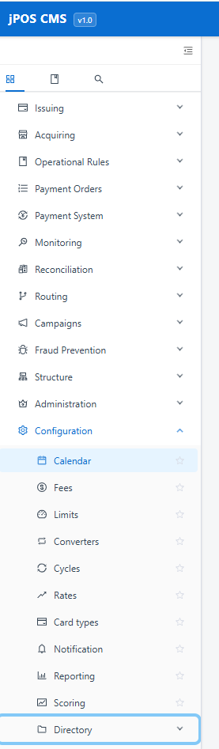

# bugs

## open bugs

## closed bugs
- [x] main menu has issue when expand to down i cannot reach to last item in menu, it show support scroll
- [x] the side menu issue still exist 
- [x] search control : the text box is bigger than button search icon — fixed with `enterButton` on `Input.Search`
- [x] Connection Rule is not applied as requested — fixed: activating a connection now deactivates all others via `deactivate_all_except` in repository + service layer
- [x] "local - BO" connection test fails — root cause: host is set to `localhost` which resolves to the backend container itself inside Docker, not the host machine. Fix: edit the connection and change Host to `172.20.0.1` (Docker gateway to reach host Oracle on port 1521)
- [x] active button should be green — fixed: active button now renders with green background (`#52c41a`)
- [x] search control issue not fixed — fixed: changed `enterButton` to `enterButton="Search"` with fixed width `360px` so input and button are balanced
- [x] make space between database connection and description — fixed: wrapped description in a `div` with `marginTop: 4` to push it below the title on its own line