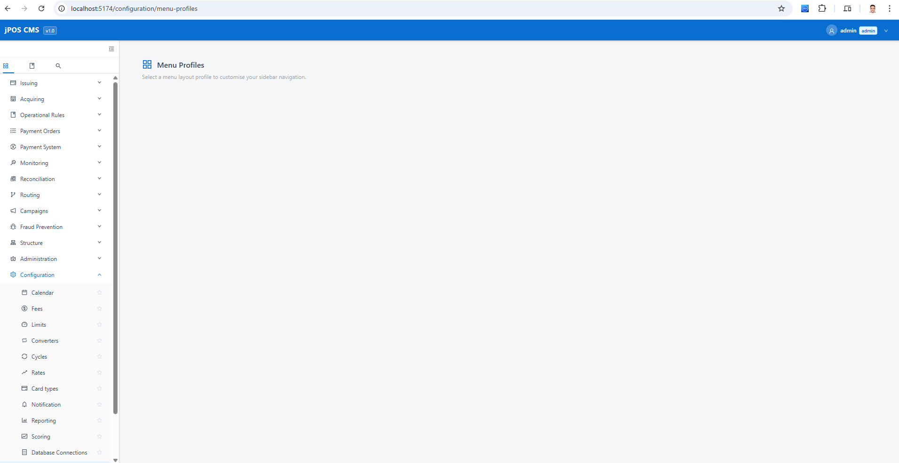
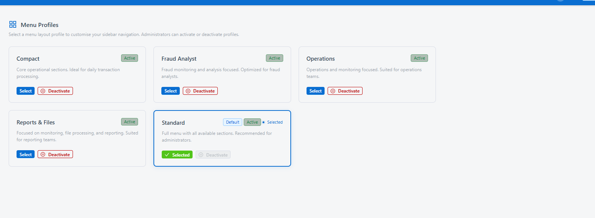

# bugs

## open bugs
- [ ] i cannot edit menu item

## closed bugs

- [x] i cannot find profile menu item to assign item to profile
  - Fixed: No endpoint or UI existed to manage `ProfileMenuItem` links. Added:
    - Repository: `get_top_level_item_ids_for_profile`, `add_item_to_profile`, `remove_item_from_profile` in `menu_profile_repository.py`
    - Service: `get_profile_item_ids`, `add_item_to_profile`, `remove_item_from_profile` in `menu_service.py`
    - Router: `GET /menu-profiles/{id}/items`, `POST /menu-profiles/{id}/items`, `DELETE /menu-profiles/{id}/items/{item_id}` in `menu.py`
    - Frontend: 3 new methods in `menuApi.js`, "Manage Items" button on each profile card in `MenuProfiles.jsx` opening an Ant Design Transfer drawer to assign/remove top-level items

- [x] menu items does not display all menu item which already defined as base menu items
  - Fixed: `GET /menu-items` was calling `get_all_top_level()` (only items with `parent_id == None` = 13 items). Added `get_all()` repository method, updated service and `MenuItems.jsx` to build a nested tree from the flat list using `parent_id`. Table now renders all 119 items as an expandable tree.

- [x] Menu items, Menu, Menu profile does not show in group "like dictionary in configuration"
  - Fixed: `_ensure_item` in `menu_seed.py` was returning early on existing items without updating `parent_id`. Added reparent logic: if existing item has a different `parent_id` than the seed defines, update it and flush. On next startup the seed corrected `/configuration/menu-profiles` and `/configuration/menu-items` to be children of `configuration-menu` group instead of direct children of `configuration`.

- [x] menu profile page is empty check the screenshot 
  - Fixed: `MenuContext` checked `localStorage.getItem('token')` but app stores token as `access_token`. Changed key so `fetchCurrentMenu()` is called on mount.

- [x] select button in menu profiles page not working check the screenshot 
  - Fixed: `POST /menu-profiles/select` used `token.get("sub")` (username string) as `user_id`, but `user_menu_profiles.user_id` is a FK to `users.id` (UUID). Added `_resolve_user_id()` helper in `menu.py` router to look up the actual user UUID from username before persisting. Same fix applied to `GET /menu/current`.